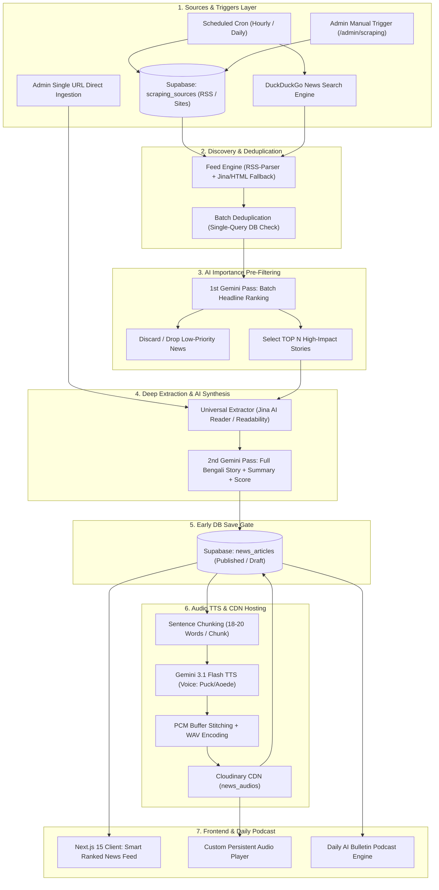
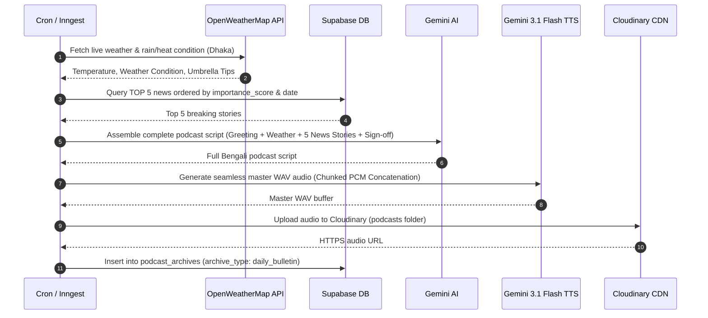

# KahfStudio (Khobor AI & Media) - System Architecture & Technical Specifications

## 1. System Overview & Core Principles

KahfStudio is an audio-first, AI-driven news aggregation and multimedia broadcasting platform. It automates the end-to-end news lifecycle: from multi-channel discovery and intelligent headline triage, to deep extraction, AI content synthesis, unlimited-duration Bengali Text-to-Speech (TTS), and automated daily audio podcasts.

---

## 2. Ingestion Sources & Triggers Layer

The pipeline accepts news from three primary ingestion channels:

| Trigger / Source Channel | Mechanism | Target Pipeline Flow |
| :--- | :--- | :--- |
| **1. Database Configured Sources** | Stored in Supabase `scraping_sources` table (RSS URLs or site listing pages). | Standard Discovery ➔ Deduplication ➔ AI Pre-Filter ➔ Extraction ➔ AI Synthesis. |
| **2. Search Engine Scraper (DDG)** | Runs scheduled background search queries via `scrape-ddg` for breaking Bangladesh/World topics. | Search Results ➔ Deduplication ➔ Deep Processing. |
| **3. Admin Direct Single URL** | Admin pastes an individual article URL in `/admin/scraping` or sends to `/api/ingest/direct`. | Bypasses RSS/Search discovery; directly enters **Deep Extraction & AI Synthesis**. |

### Supported Triggers:
1. **Automated Scheduled Cron**: Background cron jobs triggered periodically (e.g. hourly news cycles via Inngest or Vercel Cron).
2. **Admin Real-Time Scrape**: Admin triggers on-demand scraping with custom limit & category parameters via Server-Sent Events (SSE) live streaming (`/api/ingest/trigger-rss`).
3. **Targeted Single-Article Ingestion**: Instant processing for breaking news URLs.

---

## 3. Detailed End-to-End Pipeline Execution

### Step 1: Source Discovery & Smart Fallback
- Loads active sources from Supabase `scraping_sources`.
- **Primary Method:** Fast RSS parsing via `rss-parser` (with a strict 6s timeout).
- **Smart Jina/HTML Fallback:** If a source has an invalid/broken RSS XML, returns 404, or blocks with 403 (Cloudflare/bot protection), the pipeline automatically switches to **Cheerio HTML** or **Jina AI Reader** (`https://r.jina.ai/<source_url>`) to extract the latest headline links directly from the homepage or category page.

### Step 2: High-Performance Batch Deduplication
- Instead of performing sequential per-article database queries (N+1 bottleneck), all discovered candidate links are collected into an array.
- A **single batch query** (`.in("original_url", candidateUrls)`) checks Supabase `news_articles` in ~0.05s.
- Already existing URLs in the database are filtered out in memory.

### Step 3: AI Importance Pre-Filtering (1st Gemini Pass)
- **The Problem:** Deep-scraping and running full AI generation + Audio TTS on 100+ raw discovered headlines would consume excessive bandwidth, tokens, and time.
- **The Solution:** All new candidate headlines (~20-100 titles) are sent to Gemini (`gemini-3.6-flash` / `gemini-2.5-flash`) in a **single, unified prompt**.
- Gemini evaluates headline urgency, national/global relevance, and breaking significance to select the **TOP N** (default: 5-10) most impactful news items.
- Non-selected/low-priority headlines are discarded without incurring heavy downstream extraction costs.

### Step 4: Universal Content Extraction (Jina-First Architecture)
For each selected high-impact article:
- **Tier 1 (Primary):** Jina AI Reader Proxy (`https://r.jina.ai/<article_url>`). Bypasses WAF, Akamai, and IP blocks on serverless environments; extracts clean Markdown body and high-res OpenGraph/Twitter cover images.
- **Tier 2 (Fallback):** Direct HTML extraction with Mozilla Readability (DOM text density algorithm) and Schema.org JSON-LD parser.
- **Tier 3 (Fallback):** Pre-cleaned meta tags and fallback headline.

### Step 5: Unified AI News Synthesis & Scoring (2nd Gemini Pass)
The extracted raw content is passed to Gemini (`gemini-3.6-flash` / `gemini-2.5-flash`) with a structured JSON schema:
1. `clean_headline`: Engaging, clear Bengali title.
2. `clean_content`: Unabridged full Bengali article body in clean markdown (preserving narrative depth).
3. `ai_summary`: Concise 2-paragraph Bengali summary with 3 key takeaway bullet points.
4. `importance_score`: Integer rating from 1 to 100 representing news priority.
5. `detected_category`: Automatic category classification (`Politics`, `Economy`, `Technology`, `Sports`, `Entertainment`, `World`, `Bangladesh`, `Lifestyle`, `General`).

### Step 6: Early Database Save Gate (Instant Visibility)
- As soon as AI synthesis finishes, the article is **immediately inserted into Supabase `news_articles`**:
  - `status`: Set to `published` if `auto_approve_news == true` (immediately live in app feed).
  - `status`: Set to `draft` if `auto_approve_news == false` (queued in `/admin/library` for manual review).
- This guarantees that news is securely stored and available before audio processing starts.

### Step 7: Unlimited-Duration Audio TTS & Cloudinary CDN
- The clean Bengali summary is sent to the TTS synthesis engine (`generateSeamlessGeminiAudio`):
  - **Sentence Chunking:** Text is split into safe 18-20 word chunks (~8-12 seconds each). This completely avoids the Gemini TTS ~18-20s duration cutoffs.
  - **Gemini 3.1 Flash TTS:** Generates 24kHz 16-bit mono PCM audio per chunk (Voice: `Puck` for Bengali, `Aoede` for English).
  - **Seamless PCM Stitching:** Raw PCM chunks are concatenated back-to-back (`Buffer.concat`) and wrapped with a standard 44-byte WAV RIFF header.
  - **Cloudinary Upload:** The WAV buffer is streamed to Cloudinary CDN (`news_audios` folder).
  - **DB Update:** The generated HTTPS audio URL is saved to the article's `audio_bn_summary` column.
- Audio synthesis is protected with a 15s timeout to ensure pipeline responsiveness.

### Step 8: Client Serving & Smart Feed Ranking
- The Next.js frontend fetches news via `/api/news` using **Smart Ranking Algorithm**:
  $$\text{Score} = (\text{Freshness Weight}) + (\text{AI Importance Score} \times 0.5) + (\text{User Category Affinity})$$
- Audio is streamed seamlessly from Cloudinary CDN into the global persistent `AudioPlayer` widget.

---

## 4. Daily AI Podcast Generation Pipeline

KahfStudio compiles an automated daily audio bulletin podcast:

---

## 5. Technology Stack & Component Responsibilities

| Component | Technology | Responsibility |
| :--- | :--- | :--- |
| **Frontend UI** | Next.js 15 (App Router), React, Tailwind CSS, Framer Motion | Responsive web app, Smart News Feed, Media Player, Admin Dashboard. |
| **Database & Auth** | Supabase (PostgreSQL), Supabase Auth | Relational storage (`news_articles`, `scraping_sources`, `podcast_archives`, `system_settings`), RLS security. |
| **AI Models** | Google Gemini 3.6 Flash / Gemini 2.5 Flash | Title pre-filtering, full article rewriting, summarization, importance scoring, and podcast script synthesis. |
| **Audio Engine** | Gemini 3.1 Flash TTS (`gemini-3.1-flash-tts-preview`) | High-fidelity Bengali (`Puck`) and English (`Aoede`) 24kHz speech generation. |
| **Media Hosting** | Cloudinary CDN | Persistent, global edge hosting for news summary audio and daily podcast files. |
| **Feed & Web Scraper**| `rss-parser`, Cheerio, Mozilla Readability, Jina AI Reader (`r.jina.ai`) | Resilient multi-tier article extraction and WAF bypass. |
| **Search Scraper** | DuckDuckGo Scraper (`duck-duck-scrape`) | Automated search-based news discovery. |
| **Weather API** | OpenWeatherMap API | Live weather observations and umbrella advisory system. |
| **Live IPTV** | HLS.js, Custom Video Player | Streaming live Bangladeshi TV news channels. |
