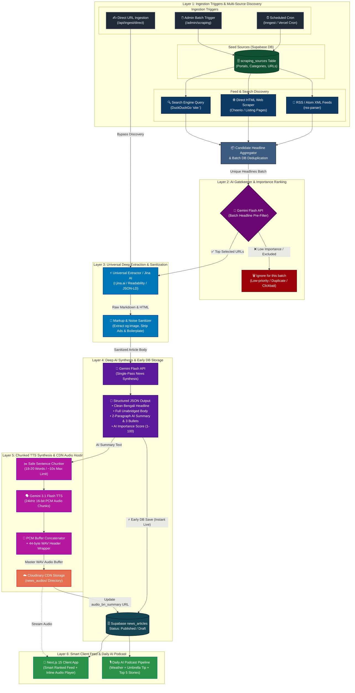

# KahfStudio (Khobor AI & Media) - System Architecture & Technical Specifications

## SECTION 1: SYSTEM OVERVIEW
KahfStudio is an audio-first, AI-driven news aggregator, multimedia streaming, and automated podcast platform tailored for Bangladesh and global audiences. It automates the complete news lifecycle:

$$\text{Multi-Source Discovery} \longrightarrow \text{AI Pre-Filter \& Rating} \longrightarrow \text{Deep Extraction} \longrightarrow \text{AI Synthesis} \longrightarrow \text{Early DB Save} \longrightarrow \text{Chunked TTS Engine} \longrightarrow \text{Cloudinary CDN} \longrightarrow \text{Smart Feed \& Podcast}$$

---

## SECTION 2: END-TO-END SCRAPING & PROCESSING PIPELINE (MERMAID)

---

## SECTION 3: DETAILED PIPELINE EXECUTION PHASES

### Phase 1: Ingestion Triggers & Multi-Source Discovery
The scraping pipeline is initiated through three trigger channels:
1. **Scheduled Background Cron:** Automated Inngest / Vercel Cron jobs running periodically (e.g. morning and evening cycles).
2. **Admin Manual Batch Ingestion:** Initiated on demand from `/admin/scraping` or `/profile/scraping` with custom category and target count parameters.
3. **Direct Single-URL Ingestion:** Admin enters a specific article link directly into `/api/ingest/direct`, bypassing the headline discovery stage and proceeding straight to deep extraction.

**Discovery Methods for Seed Sources (`scraping_sources` table):**
- **RSS / Atom Feeds:** Parses XML feeds via `rss-parser` with strict timeouts.
- **Direct HTML Scraper:** Cheerio-based crawler discovering latest article links from portal listing pages when RSS is unavailable or blocked.
- **Search Engine Ingestion:** Queries DuckDuckGo for fresh news using portal-specific query parameters (`site:`).
- **Batch Deduplication:** All candidate URLs are queried against Supabase `news_articles` in a single batch query (`.in('original_url', candidateUrls)`), reducing DB roundtrips by 99%.

### Phase 2: AI Gatekeeper & Importance Ranking (1st Gemini Pass)
- All newly discovered candidate headlines, source names, and categories are batched into a single prompt sent to Gemini Flash (`gemini-3.6-flash` / `gemini-2.5-flash`).
- Gemini acts as an executive news editor, scoring the relevance and impact of each headline and selecting the **TOP $N$ most important breaking news stories**.
- Low-priority, duplicate, clickbait, or redundant headlines are ignored for the current run, drastically reducing unnecessary scraping and AI extraction costs.

### Phase 3: Universal Targeted Deep Extraction & Sanitization
For the top approved articles, the universal extraction pipeline executes:
- **Tier 1 (Primary): Jina AI Reader Proxy (`https://r.jina.ai/<URL>`):** Distributed headless browser rendering that bypasses Cloudflare WAF, Akamai, and bot protection while extracting clean markdown text.
- **Tier 2 (Fallback): Mozilla Readability & JSON-LD:** Parses DOM text density and Schema.org metadata (`NewsArticle` / `Article`).
- **Cover Image Extraction:** Scrapes high-resolution OpenGraph (`og:image`) and Twitter card images.
- **Local Noise Sanitizer:** Strips advertisements, social buttons, navigation boilerplate, and related news widgets locally.

### Phase 4: Unified AI Synthesis & Early DB Save (2nd Gemini Pass)
- Extracted article body text is sent to Gemini Flash in a single unified prompt.
- **Structured Output Schema:**
  - `clean_headline`: Engaging Bengali news headline.
  - `clean_content`: Complete unabridged Bengali article body in clean markdown.
  - `ai_summary`: Short 2-paragraph Bengali summary with 3 key takeaway bullet points.
  - `importance_score`: Relevance and breaking score (1 to 100).
  - `detected_category`: News topic classification (Politics, Economy, Tech, Sports, etc.).
- **Early DB Save (Instant Live Availability):** The article text, summary, importance score, and cover image are **immediately saved** into Supabase `news_articles` (Status: `published` if Auto-Approve is ON, else `draft`). This ensures news appears in the library/feed without waiting for audio generation.

### Phase 5: Unlimited Chunked TTS Synthesis & Cloudinary Hosting
- **Safe Sentence Chunking:** Summary text is split into small 18-20 word sentence chunks (~8-12 seconds each), eliminating Gemini TTS API timeout and cutoff restrictions.
- **Gemini 3.1 Flash TTS Synthesis:** Generates 24kHz 16-bit mono PCM binary buffers using native Bengali voice `Puck` (or `Aoede` for English).
- **PCM Buffer Stitching (`pcmToWav`):** Binary PCM chunks are concatenated back-to-back into a master buffer and wrapped with a standard 44-byte WAV header.
- **Cloudinary CDN Upload:** Master WAV audio is streamed directly to Cloudinary CDN (`news_audios/` folder).
- **DB Audio Link Update:** The generated HTTPS CDN URL is updated on the Supabase `news_articles` record (`audio_bn_summary`).

### Phase 6: Frontend Serving & Daily AI Podcast Compilation
- **Smart Ranked Feed:** Next.js frontend queries `/api/news` with smart scoring combining AI Importance Score, freshness decay, and user category preferences.
- **Inline Custom Audio Player:** Streams WAV audio directly from Cloudinary CDN with seek, speed control (1x/1.25x/1.5x), and continuous autoplay.
- **Daily AI Podcast Pipeline:** Automated daily compiler queries OpenWeatherMap for live weather and umbrella advisories, aggregates the top 5 daily news stories, synthesizes a full podcast bulletin via Gemini TTS, and archives it in `podcast_archives`.

---

## SECTION 4: TECHNOLOGY STACK

| Component | Technology | Responsibility |
| :--- | :--- | :--- |
| **Frontend UI** | Next.js 15 (App Router), TypeScript, Tailwind CSS, Framer Motion | User interface, smart news feed, custom audio player, IPTV player |
| **Database & Auth** | Supabase (PostgreSQL), Supabase Auth | `news_articles`, `scraping_sources`, `system_settings`, `podcast_archives` |
| **Ingestion Triggers** | Next.js Serverless Routes, Inngest, Vercel Cron | Scheduled cron cycles & manual admin triggers |
| **Content Extractor** | Jina AI Reader, Mozilla Readability, Cheerio, JSON-LD | Full webpage scraping, noise sanitization, cover image extraction |
| **AI News Engine** | Google Gemini Flash (`gemini-3.6-flash`, `gemini-2.5-flash`) | Headline pre-filtering, full story rewriting, 2-paragraph summaries, importance scoring |
| **TTS Audio Engine** | Gemini 3.1 Flash TTS (`gemini-3.1-flash-tts-preview`) | Chunk-wise 24kHz PCM audio synthesis with PCM stitching (`pcmToWav`) |
| **Audio CDN Storage** | Cloudinary CDN | Persistent WAV audio hosting for news summaries and daily podcast bulletins |
| **Live IPTV Streaming**| HLS (`hls.js`), Custom Video Modal Player | Live Bangladeshi news channels streaming |
| **Weather & Context** | OpenWeatherMap API | Live ambient weather update & automated umbrella advisory |
